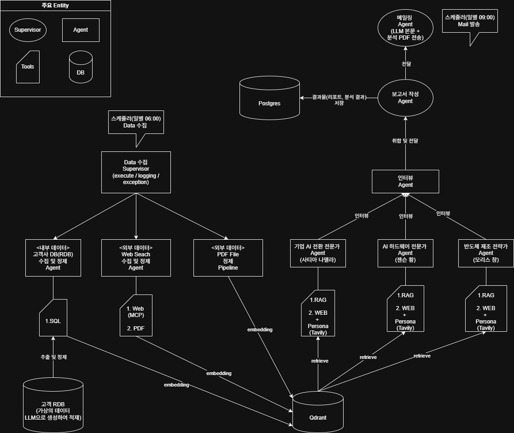

# 🤖 Kalantir AI Agent System

## 🏗️ 시스템 아키텍처

## 🎯 프로젝트 개요
**매일 자동으로 데이터를 수집하고, AI 컨설턴트들이 협업하여 
전략 보고서를 작성한 뒤, 이메일로 발송하는 End-to-End 자동화 시스템**

## 🏆 핵심 성과
- ⏰ 수동 리포트 작업 자동화 (100% 무인 운영)
- 💰 OpenAI API 비용 절감 (중복 임베딩 방지)
- 📊 3가지 데이터 소스 통합 (PostgreSQL, PDF, Web)
- 🤖 Multi-Agent 협업으로 다각적 인사이트 제공

## 🔧 기술 스택
**핵심 기술**
- LangGraph, LangChain
- MCP(Model Context Protocol)
- Qdrant(Vector DB), PostgreSQL

**백엔드 & 인프라**
- FastAPI, APScheduler

**RAG & Search**
- Hybrid Retrieval (MMR + BM25)
- Tavily Search, Exa, Brave, Perplexity

### 1. Data Pipeline Layer
- **DB Analyze Agent**: SQL Agent로 고객사 내부 DB 자율 분석
- **PDF Vectorizer**: 중복 방지 임베딩 (SHA256 해시 활용)
- **Web Search Agent**: MCP로 3개 검색 엔진 통합

### 2. Research Layer
- **Interview Graph**: 3명의 전문가 페르소나를 통한 Web Search와 병렬 인터뷰
- **RAG Pipeline**: 5단계 Hybrid Retrieval
  - MMR Vector Search
  - 중복 제거
  - Hybrid Reranking (Vector + BM25 + Time)
  - LITM Reordering

### 3. Automation Layer
- **APScheduler**: 매일 06:00 데이터 수집 → 리서치
- **Email Agent**: 매일 09:00 보고서 자동 발송